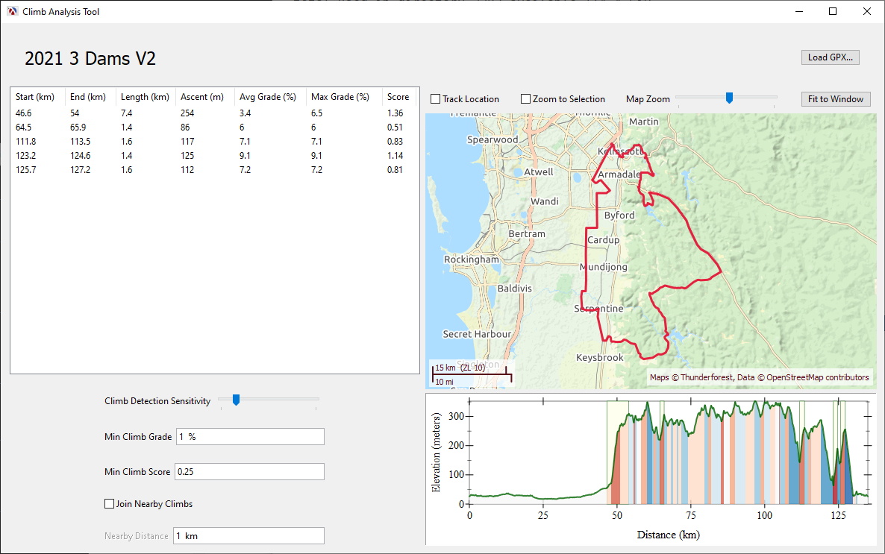

# AL2-Climb-Analysis Tool

A small [Racket][racket] application used analyze the climbs of a bike route
(loaded from a GPX file).  For more information, see this [blog post][blog].



## Building the application

You will need [Racket][racket] installed and also the [data-frame][df],
[gui-widget-mixins][gwm], [plot-container][pc], [map-widget][mw] and
[colormaps][cm] packages.  These can be installed using the following
commands:

```
raco pkg install data-frame
raco pkg install gui-widget-mixins
raco pkg install plot-container
raco pkg install map-widget
raco pkg install colormaps
raco pkg install qresults-list
```

You can run the application from DrRacket by opening the
"al2-climb-analysis.rkt" file and run it, but you can also build a standalone
executable.

## Sample Files

Here are some sample files to test out the applications (most sites allow
exporting bike routes as GPX files, so you can analyze your own routes as
well):

* [Kalamunda 100][k100]
* [5 Dams Challenge (2021 route)][dams5]
* [3 Dams Challenge (2021 route)][dams3]
* [2 Dams Challenge (2021 route)][dams2]

[df]: https://pkgs.racket-lang.org/package/data-frame
[gwm]: https://pkgs.racket-lang.org/pkgn/package/gui-widget-mixins
[racket]: https://www.racket-lang.org
[pc]: https://pkgs.racket-lang.org/pkgn/package/plot-container
[mw]: https://pkgs.racket-lang.org/package/map-widget
[cm]: https://pkgs.racket-lang.org/package/colormaps

[k100]: https://drive.google.com/file/d/1gjpoNrvwYnh6QBHi2DPU7Xh3uUIFB4_i/view?usp=sharing
[dams5]: https://drive.google.com/file/d/16vtRKMd15zfBSK3FdLKoheyFFaSx53SV/view?usp=sharing
[dams3]: https://drive.google.com/file/d/1i1ZJHx5VW1xfA9QMDYBichuWBeHACUxQ/view?usp=sharing
[dams2]: https://drive.google.com/file/d/1-wlVUvWV0jMII-comV4em31ZL8hQ2X_e/view?usp=sharing
[blog]: https://alex-hhh.github.io/2021/04/climb-analysis-tool.html
